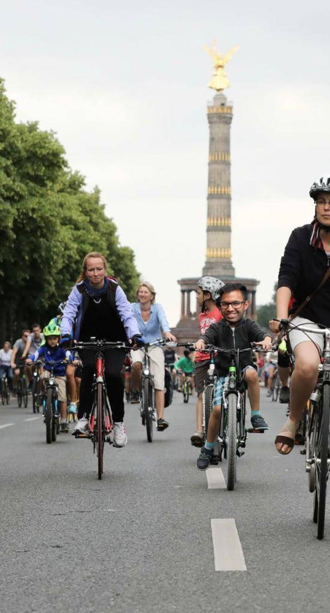

Du nimmst dir das nächst beste Fahrrad das nicht angeschlossen war und fängst an loszuradeln.
Nachdem du vier mal fast überfahren wurdest, grummelst du: "Autos raus aus Berlin" und fühlst dich gut, den Volksentscheid unterschrieben zu haben.
Doch wohin fährst du eigentlich? Du hast erstmal Lust in einem Park runterzukommen.

<a href="/görli">
<button>Görli</button>
</a>
<a href="/mauerpark">
<button>Mauerpark</button>
</a>