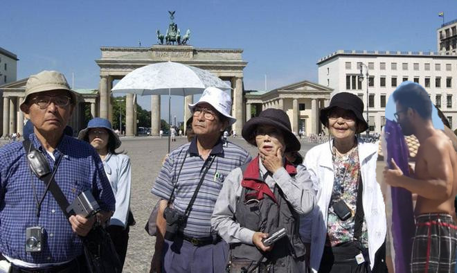

Die eine Konstante aller großer Städte der Welt: chinesische Touristen. Du tarnst dich als Badegast und verschwindest so schnell in der Menge. Die Chinesen nehmen dich gastfreundlich in ihre Gruppe auf und du verbringst einen schönen Tag damit, absolout uninteressante Sachen zu fotografieren.

<a href="/behnam.github.io/">
<button>Zurück zum Anfang</button>
</a>